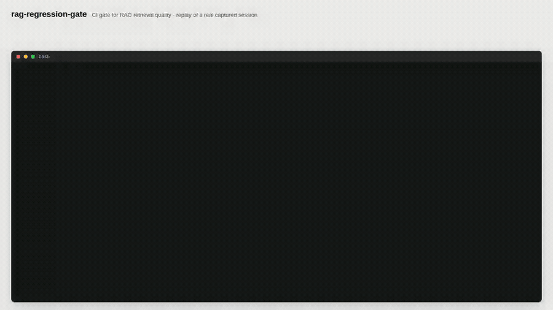
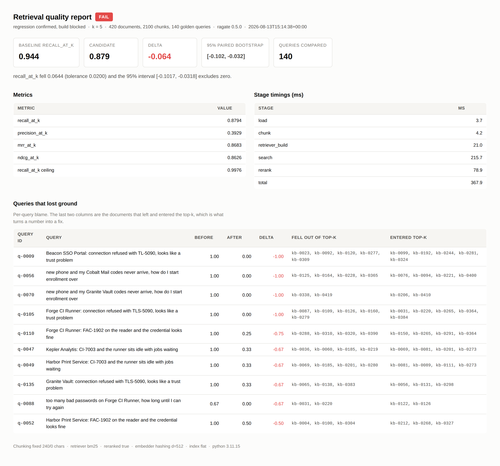
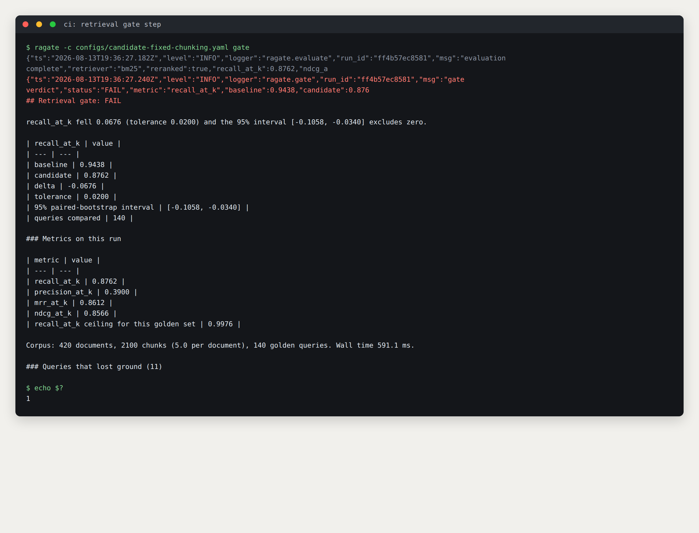
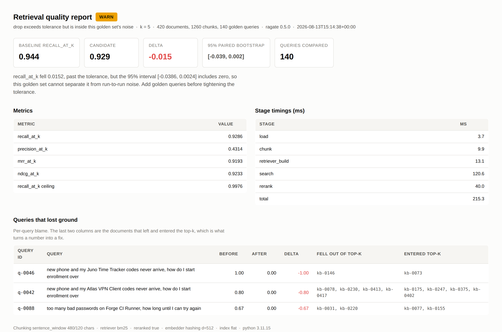
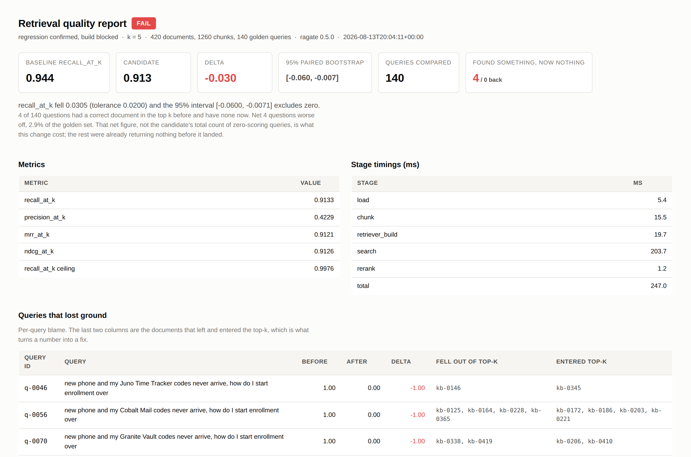
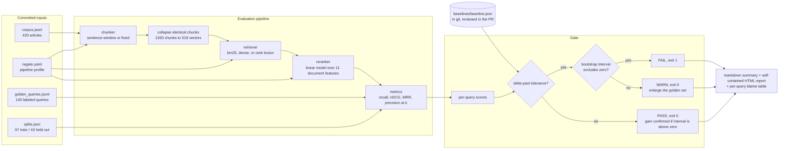
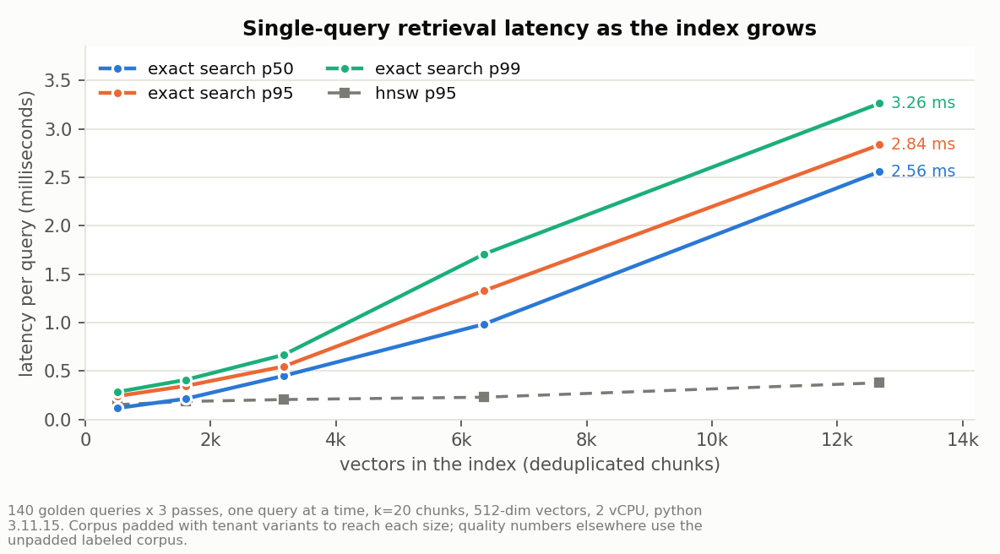
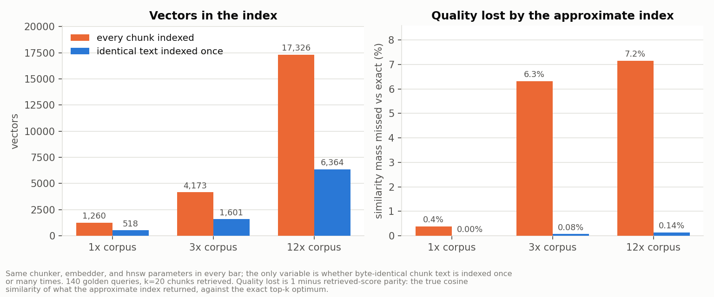

# rag-regression-gate

**A CI gate that blocks a pull request when RAG retrieval quality drops, and confirms when a change genuinely improved it, using a tolerance plus a paired bootstrap so noise on a small golden set cannot cry wolf.**

[](https://github.com/sivananda1995/rag-regression-gate/actions/workflows/ci.yml)
[](#tests-coverage-and-receipts)
[](#tests-coverage-and-receipts)
[](#every-number-here-is-checked-by-ci)
[](#the-four-outcomes-on-real-runs)
[](LICENSE)

## What this solves

- **A chunker or model change silently breaks retrieval and nothing fails.** This gate scores a labeled golden set on every pull request and exits non-zero on a real drop: in the included demo it catches a fixed-size chunking change that costs 6.8 points of recall@5 and takes 5 of 140 questions from answered to unanswered.
- **Threshold-only gates fire on noise, so teams switch them off.** A drop must clear the agreed tolerance *and* a 95% paired bootstrap interval that excludes zero. The included borderline case, a drop of -0.0152 with interval `[-0.0386, 0.0024]`, is reported as WARN with an instruction to enlarge the golden set, not as a failed build.
- **"Recall went up" is an argument until someone measures it.** The same machinery confirms improvements: the reranker in this repository earns +0.0305 recall@5 with interval `[0.0071, 0.0600]`, and that is why it shipped. Two other plausible improvements were measured and thrown away, which is documented below.

## Executive summary

Retrieval pipelines fail quietly. A model swap, a chunk-size tweak, or a normalisation change moves which documents come back, and usually nothing in CI notices, because the unit tests still pass and the service still returns 200. The failure surfaces later as users not finding answers. In this repository's own demo, one plausible refactor, sentence-window chunking replaced by fixed 240-character slices, drops recall@5 from 0.9438 to 0.8762. Underneath that average: 5 questions that had a correct document in the top 5 now have none, and 1 that had none now finds one, so the change leaves a net 2.9% of the golden set answerless. 11 questions score zero after the refactor, but only those 5 are its fault; the rest were already returning nothing before it landed, and quoting the total would charge this change for breakage it did not cause. On a support search handling 5,000 queries a day, the net share is roughly 140 searches a day that stop finding their answer; the 5,000 is an assumption, every other number in this paragraph is measured and re-measured in CI.

`ragate` turns retrieval quality into a build status. It scores a labeled golden set through a configurable pipeline (chunker, retriever, reranker), records per-query scores, and compares a candidate run against a baseline committed to git and reviewed in the pull request like any other file. Failing a build needs two independent conditions: the metric must fall further than the tolerance the team agreed on, and a paired bootstrap over per-query differences must place the whole confidence interval below zero. When only the first holds, the gate says so and asks for more golden queries rather than blocking anyone.

The default pipeline scores recall@5 of 0.9438 across all 140 golden queries against a theoretical ceiling of 0.9976, with nDCG@5 of 0.9340 and MRR@5 of 0.9268, and a full gate run takes about a quarter of a second. Every tunable in it was fitted on a 97-query train split and every gain is quoted on the 43 held-out queries it was not fitted on. All four gate outcomes are reproduced by `tools/run_demo.sh`, the screenshots below are that script's output, and `make verify` re-measures every number quoted in this document, in `ragate.yaml`, and in two other files that cite a measurement, and fails if any of them has moved.

## Watch it work (30 seconds)



Every line of terminal text above is the real stdout and stderr of the command shown with it, captured by `tools/record_demo.py`, with each segment's reveal paced by that command's measured wall time. It is a replay of a captured session rather than a live screen recording, and `docs/video/manifest.json` lists each command with its exit code and measured duration. Higher-quality MP4: [`docs/video/gate-demo.mp4`](docs/video/gate-demo.mp4).

## The four outcomes on real runs

**A regression, blocked. Exit code 1.** Fixed-size chunking: recall@5 0.9438 to 0.8762, delta -0.0676, 95% interval `[-0.1058, -0.0340]`, status FAIL, with 11 queries named in the blame table and the blast radius stated separately, because a query that lost its last correct document is a different event from one that slipped a rank.



**The same run as CI sees it**, structured JSON logs and the markdown summary that lands in the job summary:



**A drop the gate refuses to call a regression. Exit code 0.** Narrowing the reranker window and tightening the tolerance to 1 point: recall@5 0.9286, delta -0.0152, interval `[-0.0386, 0.0024]`, status WARN, 3 queries affected. The interval contains zero, so 140 queries cannot separate this from run-to-run noise, and the gate says exactly that.



**An improvement, confirmed rather than argued.** Run the current pipeline against the pre-reranker baseline and the gate reports +0.0305 with interval `[0.0071, 0.0600]`, which excludes zero. Read the other way, turning the reranker off is itself a regression: recall@5 0.9133, delta -0.0305, interval `[-0.0600, -0.0071]`, status FAIL again, with 5 queries affected. That is how the reranker earned its place in the default configuration.

```
$ make prove-reranker
## Retrieval gate: PASS
recall_at_k rose 0.0305 and the 95% interval [0.0071, 0.0600] excludes zero,
so the gain is larger than this golden set's run-to-run noise.
```



## Architecture



Failures are handled at four boundaries, each refusing rather than guessing: corpus loading rejects a golden label pointing at a missing document, config loading rejects an unknown key or an impossible value, the reranker rejects a model trained on a different feature set, and the gate refuses to compare two reports whose corpus content or `k` differ.

## What the gate told me to throw away

This is the part of the repository I would most want reviewed, because it is the tool doing its job on its own author.

**Rejected: hybrid retrieval.** Fusing BM25 with the dense retriever by reciprocal rank is the standard recommendation, and it did not work here. BM25 alone scores 0.9133 across all queries while the equal-weight fusion scored lower, and a sweep over seven dense weights and four `rrf_k` values, selected on the train split only, landed on a dense weight of 0.0, which is BM25 by another name. Checking per query explained it: the dense retriever, a reproducible hashing embedder rather than a semantic model, beat BM25 on **zero** of the 140 golden queries, scoring 0.8636 overall. Fusion cannot add information that one component does not have. The BM25 implementation, the fusion code, and the sweep all stay in the repository, because the question becomes live again the moment a real embedding model is plugged in, and then the sweep answers it in one command. See `docs/tuning_report.json` and ADR-004.

**Rejected: reranking chunks.** The first reranker scored the chunks that retrieval returns, which seemed obvious, and it destroyed held-out recall: 0.9070 down to 0.8411, a loss of 0.0659, while looking fine in training. The coefficients gave it away. The largest positive weight, +0.6538, sat on the number of documents a chunk belongs to. That is not a relevance signal. A chunk shared by thirty articles has thirty chances of touching one of the labeled documents, so a chunk-level label rewards promoting boilerplate, while recall@5 counts distinct documents and is unimpressed. The rejected variant is preserved as a runnable experiment (`python experiments/chunk_level_reranker.py`) so this paragraph can be checked instead of believed.

**Kept: reranking documents.** Aggregating the evidence from every retrieved chunk up to the document, labeling documents, and ranking documents put the model and the metric back on the same objective. Trained on 4068 candidate documents from the 97 train queries, it scores 0.9395 in sample and 0.9361 out of fold, and on the 43 held-out queries it moves recall@5 from 0.9070 to 0.9535. The gap between in-sample and out-of-fold is 0.0034, which is the useful signal: with eleven features and a linear model there is almost nothing to memorise.

## Method: what may look at which queries

A retrieval harness that fits anything on the queries it reports on will publish numbers that are too good and mean nothing. The discipline here is mechanical:

| Artifact | Fitted on | Reported on |
| --- | --- | --- |
| Fusion weights and `rrf_k` (`tools/tune_retrieval.py`) | train split, 97 queries | eval split, and the gap between the two is stated |
| Reranker coefficients (`tools/train_reranker.py`) | train split only, with GroupKFold grouped by query id | out of fold within train, then the held-out eval split |
| Any claim of a gain in this README | nothing | eval split, 43 queries nothing was fitted on |
| The gate's own verdicts | not applicable | all 140 queries, because a verdict is a difference between two runs on the same set, where a constant bias cancels |

That last row matters and is easy to get wrong in the other direction. Leakage inflates an absolute score, but the gate compares two runs over identical queries, so an inflated absolute level affects both sides equally and cancels out of the difference. The number that must be leak-free is the *claimed gain*, and those are quoted on the eval split throughout. The split lives in `data/splits.json`, is stratified by task family, and is generated once by `tools/make_splits.py` so a later edit to that script cannot move the boundary under a published number.

## Tech stack

| Technology | Role in this project | Why chosen here |
| --- | --- | --- |
| Python 3.10+ | The whole tool | The gate runs as a step in someone else's CI after one `pip install`, which rules out a heavier runtime |
| numpy | Vector math, exact search, bootstrap resampling | 5,000 bootstrap resamples are one fancy-indexing operation on a 5,000 by 140 matrix; a Python loop would take seconds instead of milliseconds |
| BM25 Okapi, implemented here | Default retriever | Written from the published formula and asserted against arithmetic computed outside the implementation, because a repository whose claim is traceability should not have an opaque scorer at its core |
| Custom hashing embedder (blake2b) | Dense retriever's embedding provider | Reproducible to the bit with no network and no model download, so a baseline recorded today is comparable tomorrow. Python's built-in `hash()` is salted per process and would break that |
| FAISS HNSW (optional) | Second index backend | Lets the approximate-search penalty be measured deliberately rather than absorbed into the gate's noise floor (ADR-001) |
| scikit-learn (dev only) | Trains the reranker | Training is a developer task; inference is 20 lines of numpy, so adopting the gate does not drag scikit-learn into a CI image |
| PyYAML with an `extends` key | Config profiles | A candidate pipeline is the lines that differ from `ragate.yaml`, so the pull request diff is the change itself rather than a forty-line copy that drifts |
| pytest, pytest-cov | 186 tests, 92% line coverage | Metrics and BM25 are asserted against hand computation, so a refactor cannot quietly redefine recall |
| ruff | Lint and import order | One fast tool, runs on every commit |
| Playwright with Chromium, ffmpeg | Screenshots and the demo video, in `tools/` | Every image and the video in this README are rendered from the tool's real output, so the documentation cannot drift from the behaviour |
| matplotlib | Benchmark charts | Generated from `benchmark/results/*.json`, never drawn by hand |
| GitHub Actions composite action | Distribution | `action.yml` makes adoption five lines in another repository, which is the difference between a demo and a tool |

## Quickstart

Prerequisites: Python 3.10 or newer, `git`, and about 200 MB of disk for the optional FAISS extra.

```bash
git clone https://github.com/sivananda1995/rag-regression-gate.git
cd rag-regression-gate
python -m venv .venv && source .venv/bin/activate    # Windows: .venv\Scripts\activate
pip install -e ".[dev,faiss,train]"

ragate eval -o reports/candidate.json   # score the golden set
ragate gate                             # compare against the committed baseline, exit 0
make demo                               # reproduce all four gate outcomes, one exits 1
make verify                             # lint, 186 tests, and re-measure every documented number
```

`make help` lists every target. The corpus regenerates deterministically (`python data/generate_corpus.py --docs 420 --queries 140 --seed 20260812` reproduces the committed files byte for byte), and so do the split, the reranker, the benchmarks, and the charts.

To use it on your own pipeline, point the profile at your data, record a baseline on a commit you trust, and commit it:

```bash
ragate -c my-profile.yaml baseline    # writes baselines/baseline.json
git add baselines/baseline.json && git commit -m "chore(baseline): record retrieval baseline"
```

In another repository, as a step:

```yaml
- uses: sivananda1995/rag-regression-gate@main
  with:
    config: ragate.yaml
    baseline: baselines/baseline.json
    warn-only: "false"
```

## Performance under load

Method: `benchmark/bench_retrieval.py` times single-query searches one at a time rather than batched, because that is what a caller experiences and what the gate itself does. 140 golden queries times 3 passes per data point, k = 20 chunks retrieved, 512-dimension vectors, exact and HNSW backends over identical vectors. Hardware: 2 vCPU, 7 GB RAM container, Python 3.11.15. Corpora larger than the labeled one are padded with tenant-variant articles for size only; every quality number in this README comes from the unpadded labeled corpus.



| corpus | documents | chunks | vectors indexed | exact p50 | exact p95 | exact p99 | HNSW p95 | HNSW score parity |
| --- | --- | --- | --- | --- | --- | --- | --- | --- |
| 1x | 420 | 1260 | 518 | 0.117 ms | 0.241 ms | 0.284 ms | 0.152 ms | 1.00000 |
| 3x | 1260 | 4173 | 1601 | 0.213 ms | 0.345 ms | 0.408 ms | 0.185 ms | 0.99928 |
| 6x | 2520 | 8380 | 3167 | 0.450 ms | 0.547 ms | 0.667 ms | 0.205 ms | 0.99713 |
| 12x | 5040 | 17326 | 6364 | 0.984 ms | 1.329 ms | 1.707 ms | 0.229 ms | 0.99509 |
| 24x | 10080 | 34489 | 12,673 | 2.559 ms | 2.836 ms | 3.263 ms | 0.378 ms | 0.99488 |

Where it degrades, honestly: exact search is O(n log n) per query here rather than O(n), and the table shows it, with p95 rising from 0.241 ms at 518 vectors to 2.836 ms at 12,673. The log factor is a deliberate cost. An earlier version used `np.argpartition`, which is O(n) and about twice as fast at the largest size, and whose tie behaviour is unspecified: it produced different verdicts on different machines, which is the failure described in [ADR-006](docs/adr/ADR-006-deterministic-ranking.md). Paying 1.4 ms at 12,673 vectors to make a verdict reproducible is not a close call.

The distribution is tighter than it used to be as well: p99 is now 1.28x p50 rather than 4x, because a full sort has none of the branch-dependent variance a partition does. HNSW stays nearly flat across the whole range and gives up 0.5% of similarity mass at the largest size. For a golden set none of this bites, since a full 140-query gate run still costs about a quarter of a second; past roughly 10^6 vectors the gate should switch backends, and ADR-001 states the trigger.

"Score parity" is the honest way to measure an approximate index: the true cosine similarity of what HNSW returned, divided by the true cosine similarity of the exact top-k. Top-k set overlap alone punishes an index for swapping two documents of equal similarity, and it was the misleading measure that nearly produced a wrong conclusion here, described below.

## Tests, coverage, and receipts

186 tests, 92% line coverage, measured with `pytest --cov=ragate`. CI enforces a 90% floor by parsing `coverage.xml`, so the badge cannot rot. The uncovered remainder is dominated by two adapters that cannot be exercised where this was built: the OpenAI embedding provider and the Anthropic reranker both need network access the build environment does not have. Their error paths and pure logic are tested, their request paths are not, and no number in this README comes from either.

### Every number here is checked by CI

A README quotes a measurement, the code changes, the number stays, and a year later the document is confidently wrong. So the numbers in this file are not maintained by hand:

```bash
make receipts     # or: python tools/collect_metrics.py && python tools/check_readme_numbers.py
```

`tools/collect_metrics.py` re-runs the pipeline, the gate scenarios, the tuning sweep, the reranker training, the rejected experiment, both benchmarks, and the test suite, then writes every resulting value to `docs/metrics.json` with the exact command that produced it. `tools/check_readme_numbers.py` then asserts that every one of those values still appears where it is claimed, and fails with a list of stale ones. Both run in CI, so a number that moves breaks the build exactly like a failing test.

Two properties of the check matter more than the idea of it, and both were added after the first version failed to catch anything:

- **Values are pinned to the sentence that makes the claim, not to the file.** A metric registers an anchor phrase, `"{} queries named in the blame table"`, and the check requires that exact string. Searching a long document for `11` always succeeds, which is how a sentence saying 10 survived a check that reported "every number matches".
- **Every file that quotes a measurement is checked, not just this one.** `checked_documents` in the registry currently covers the README, `ragate.yaml`, one candidate profile, and one module docstring, because those were the places where measured numbers had already gone stale unnoticed.

A metric whose display string is too short to search for and which declares no anchor fails the check by itself, so the weak form cannot come back by accident. [ADR-007](docs/adr/ADR-007-anchored-receipts.md) has the full reasoning.

## Architecture Decision Records

Full records in [`docs/adr/`](docs/adr/):

- [ADR-001: exact search is the default index for evaluation, with HNSW available](docs/adr/ADR-001-exact-search-for-evaluation.md). The gate measures the pipeline, so the index must not contribute its own error.
- [ADR-002: the baseline is a JSON file in git, not a row in a tracking server](docs/adr/ADR-002-git-committed-baseline.md). The boring choice, taken against MLflow on purpose.
- [ADR-003: a drop must clear both a tolerance and a paired bootstrap interval](docs/adr/ADR-003-paired-bootstrap-over-fixed-threshold.md). Why a paired bootstrap rather than a t-test, and why the gate may answer "I cannot tell".
- [ADR-004: rank fusion, and why the hybrid retriever is off by default](docs/adr/ADR-004-rank-fusion-and-why-hybrid-is-off.md). A measured negative result and the condition for revisiting it.
- [ADR-005: the reranker ranks documents, and is evaluated out of fold](docs/adr/ADR-005-document-level-reranking-and-out-of-fold-evaluation.md). The objective-mismatch bug and the train/eval discipline.
- [ADR-006: ranking is a total order, quantised, with an explicit tie break](docs/adr/ADR-006-deterministic-ranking.md). Why `np.argpartition` made this gate give different verdicts on different machines, and what replaced it.
- [ADR-007: measured numbers are pinned to the sentence that claims them](docs/adr/ADR-007-anchored-receipts.md). How the receipts check reported "every number matches" while three were wrong, and the impact claim it was hiding.

## Intentionally out of scope

- **Generation quality.** This gate stops at retrieval: which documents come back, in what order. Answer faithfulness needs a different harness and a different labeling cost, and conflating the two produces a metric nobody can act on. Trigger to add it: retrieval is fenced by this gate and regressions still reach users.
- **A semantic embedding model.** The dense retriever is a reproducible hashing embedder, and the honest reading of the numbers is that it contributes nothing next to BM25 on this corpus. A real embedding model belongs behind the existing `Embedder` protocol and would make hybrid retrieval worth re-testing; the sweep that answers that question is already written.
- **Trend history and dashboards.** `git log baselines/baseline.json` is the trend view. Trigger: more than one evaluation profile per repository, or comparing more than about 20 historical runs (ADR-002).
- **A cross-encoder or LLM reranker.** The interface is in the repository (`src/ragate/rerank/llm.py`, with batching, a strict output contract, bounded retries, and a token counter) but it has never been executed, so it ships switched off and unclaimed. Trigger: a reranking budget in the tens of milliseconds per query and a key in CI.
- **Per-slice verdicts.** The golden set already tags each query with a scope and a task family, and an aggregate hides a change that helps one class while breaking another. This is the next thing I would build.

## Security and compliance

- **Secrets.** No credential is read from a config file. The two optional providers read `OPENAI_API_KEY` and `ANTHROPIC_API_KEY` from the environment at construction time. In CI those come from Actions secrets; the production path is a cloud secret manager or Vault injected at process start.
- **What is never logged.** Log records carry metric values, counts, timings, and identifiers. Query and document text are never logged, because a golden set built from real user questions contains whatever users typed, which in a support corpus routinely includes names, account numbers, and internal hostnames. Query text appears only in the HTML and markdown reports, which are build artifacts under the same access control as the repository.
- **The model artifact is reviewable and inert.** `models/reranker.json` holds coefficients as JSON rather than a pickle, so loading it cannot execute code and changing it shows up as a readable diff.
- **Least privilege in CI.** The workflow declares `permissions: contents: read`. The gate needs write access to nothing: it reads the repository, writes files into the workspace, and communicates through an exit code.
- **Supply chain.** Runtime dependencies are numpy and PyYAML. FAISS, scikit-learn, and the LLM SDK are optional extras, so a consumer that does not need them does not install them.
- **Data.** The committed corpus is synthetic, generated from a seeded template grammar. No customer text, no scraped content, no licence question.

## Failure modes

| Failure | Detection | Behaviour | Recovery |
| --- | --- | --- | --- |
| Baseline missing | `load_baseline` checks the path before any work | Exit 3 naming the command that creates one | `ragate baseline` on a trusted commit, then commit the file |
| Corpus or golden set edited without re-recording | Each report carries sha256 of the corpus, sha256 of the golden set, and `k`; the gate compares fingerprints first | Exit 3 naming the field that differs, rather than reporting a fake regression | Re-record; the diff shows the new reference. Verified by editing one corpus line in place, which exits 3 naming `corpus_sha256` |
| Reranker model missing or trained on different features | Validated at load against the current feature names | Exit 2 naming `tools/train_reranker.py` | Retrain, or set `rerank.enabled=false` |
| A golden label points at a deleted document | Query loading validates every label against the corpus | Exit 2 naming the query and the missing ids | Fix the label or restore the document. As a warning it would depress recall permanently and silently |
| Embedding or reranking provider down or rate-limiting | Adapters retry with exponential backoff, logging each attempt | The LLM reranker falls back to retrieval order, because a reranker outage should degrade quality rather than break the gate. The embedder raises, because without vectors there is no verdict to give | CI retries; a persistent outage is an infrastructure incident and the gate correctly declines to guess |
| Malformed corpus or golden-set line | JSONL reader reports file and line number | Exit 2 | Fix the named line. The parser never skips a bad record, because a silently dropped query changes the metric |
| Duplicate `doc_id` in the corpus | Rejected at load | Exit 2 | Deduplicate. Two documents sharing an id make the blame table ambiguous |
| Corpus outgrows exact search | Stage timings appear in every report and log line | No automatic behaviour; the numbers make it visible | Switch to `index.backend=faiss` after measuring the parity cost (ADR-001) |
| Flaky verdicts across re-runs | Not possible by construction: the bootstrap seed is fixed, ties break on index, and no component has an unseeded random source | Identical inputs always produce an identical verdict | If a verdict changes, the inputs changed, and the fingerprint plus per-query scores show where |

## Hardest problem solved

Three, and the order they arrived in is the point: the receipts check caught the first one
after it was pushed, and then the first one's fix exposed that the check itself was weaker
than it claimed to be.

### The gate gave different verdicts on different machines

The first push to GitHub failed the `readme-receipts` job. Three numbers differed between the
runner and the machine this was built on, with identical code, identical data, and the same
committed model: the candidate profile scored 0.8826 there and 0.8794 here, with the delta
and the bootstrap interval shifted to match.

The first suspect was the interpreter's hash seed, since this project had already been bitten
by set iteration order leaking into a computed result. Four runs under different
`PYTHONHASHSEED` values returned 0.879405 every time, which ruled it out.

Then I counted ties, and there it was: **24 of the 140 golden queries have an exact tie at the
k=5 boundary**, because a templated corpus produces documents with bit-equal BM25 scores. The
retriever used `np.argpartition` to take the top k, and `argpartition` does not define which of
several equal elements lands inside the cut.

The next hypothesis was the numpy version, and it was wrong too: running the pre-fix code
under both 1.26.4 and 2.4.4 gave the local value, 0.879405, both times. So the runner differs
in something a version pin does not reach, most likely CPU feature dispatch inside the
partition kernel. Chasing that further would have been the wrong move, because it is not the
problem. The problem is that a tie had no defined answer, so *any* difference in the machine
was free to change the verdict, and that is provable without reproducing the runner:
multiplying every score by `1 + 1e-12 * noise`, the scale at which two machines' arithmetic
differs, moved recall@5 from 0.828929 to 0.830714.

The fix was to stop leaving the decision to the sort, in `src/ragate/ranking.py`: quantise
scores to 9 decimals before comparing, then rank with `lexsort` using the index as an explicit
secondary key. Query terms are now summed in sorted order too, since floating-point addition
is not associative. The ranking is now identical under perturbations of 1e-12 and 1e-9, under both numpy
1.26.4 and 2.4.4 to six decimal places, and bit-identical across BLAS thread counts of 1, 2, 4
and 8 combined with four interpreter hash seeds, which is the closest local proxy for a runner
that dispatches different CPU kernels. `tests/test_ranking.py` asserts the perturbation
property so it cannot regress. It costs a full sort instead of a partition,
which roughly doubled p95 latency at the largest index size, and that is a trade I would make
again without thinking about it: [ADR-006](docs/adr/ADR-006-deterministic-ranking.md).

Two things are worth saying about this one. The receipts check paid for itself on its first
real use, catching a defect that no test on one machine could have found. And the honest
consequence is that every number in this README moved slightly when it was fixed, because the
tie ordering changed; the values here are the reproducible ones.

### The check that guards every number was passing without checking anything

With the ranking fixed, `make receipts` printed "every number in the readme matches a value
this build measured". It was wrong three times over, in the file it had just approved.

The check asked `value in readme_text`. For `0.8762` that is a real assertion. For `11` it is
not, because any long document contains `11` somewhere, and short strings are exactly what
counts of things look like. Three defects were sitting inside that blind spot: the sentence
describing the blame table said 10 queries where the gate lists 11, the Quickstart advertised
159 tests when the suite had 170 at the time, and a config comment plus a module docstring
were not read
at all, so the candidate profile's header still quoted the pre-fix recall that ADR-006 had
just replaced.

Two changes close it. A metric can pin its value to the phrase that carries it, `"{} queries
named in the blame table"`, so the check reads the claim instead of scanning the document; and
a metric whose display string is short enough to be ambiguous and which declares no phrase now
fails on that basis alone, so the weak form cannot return by accident. The registry also lists
every file that writes a measured number down, not just the README, because two of the three
stale numbers were not in the README.

Then the part worth the section. Repairing the check meant re-reading the sentence it had
failed to check, and the sentence was making a claim the data did not support:

> leaves 10 of 140 labeled questions with no correct document in the top 5. On a support
> search handling 5,000 queries a day, that ratio works out to roughly 360 searches a day
> that stop finding their answer

Eleven queries score zero under the candidate, not ten. But the number that belongs in that
sentence is neither, because 7 queries were already scoring zero on the *baseline*. The
refactor pushed 5 queries from an answer to nothing and, by accident, gave 1 an answer it did
not have before. Its true cost is a net 4 queries, 2.9% of the golden set, and about 140
searches a day. The original sentence charged the change for breakage that predated it and
overstated the business impact by a factor of two and a half. Nothing in the tolerance, the
bootstrap, or the receipts check could have caught it: every number was arithmetically
correct and the reasoning on top of them was not.

So it became a gate feature rather than a copy edit. `GateVerdict` now reports
`blanked_queries` and `recovered_queries` beside the blame list, both markdown and HTML
reports print a blast-radius line built from the pair, and `net_blanked` carries a docstring
explaining why the candidate's total zero count is the wrong number to quote. A retrieval gate
whose own README overstated a regression by 2.5x had a gap where its most useful output should
have been.

### The approximate index looked fine, then it looked broken, and both readings were wrong

Comparing HNSW against exact search by the obvious measure, how much of the top-k document set the two agree on, gave 0.97 at the base corpus size, which is what the literature predicts. Padding the corpus to three times its size dropped agreement to 0.57, and twelve times to 0.54. Read at face value that says HNSW is unusable at any real scale, which contradicts most of the industry, so the measurement was likelier wrong than the index.

First hypothesis: ties. If many chunks score almost identically, set overlap punishes an index for returning an equally good document in a different order. So I checked the score spread across the top 20 and built a tie-insensitive measure, retrieved-score parity: the true cosine similarity of what HNSW returned divided by the exact optimum. It refuted the hypothesis rather than confirming it. Parity was 0.93676 at 3x with a worst case of 0.23, and on the worst query all six HNSW results shared an identical similarity of 0.1132 while exact search was returning 0.24. That is not tie ordering, that is a search landing somewhere bad.

Second hypothesis, technically right and practically irrelevant: I had built the index with `METRIC_INNER_PRODUCT`. HNSW navigates by greedy descent over a proximity graph and that descent assumes a true metric, which inner product is not. For unit-length vectors squared L2 is order-equivalent to cosine, so the correct metric is free and I switched to it. Then I measured the switch in isolation and it moved parity by less than a point, inside run-to-run variation. I kept the change because it is correct by construction, and the comment in `indexes/faiss_index.py` says it was not a measured win, because a comment claiming a win the numbers do not support is worse than no comment.

The actual cause turned up by counting: 2,422 of the 3,780 chunks in the padded index were byte-identical to another chunk. The corpus is templated, as real knowledge bases are, so whole passages repeat across articles, and my padding function made it worse by prefixing only the title, leaving every later chunk identical across tenants. Duplicate points wreck an HNSW graph, because neighbour selection cannot build a useful neighbourhood from vectors at zero distance from each other, and greedy search gets trapped among the copies. The fix was to stop indexing the same text twice: group chunks by exact text, index each text once, and carry every document id that text belongs to, expanding hits back to documents at scoring time. On the labeled corpus that removed 58.9% of the vectors, 1260 chunks down to 518, cut a full evaluation roughly in half, and restored parity from 0.93676 to 0.99925 at 3x and from 0.92844 to 0.99857 at 12x.

Two things stayed behind. Parity is now a first-class benchmark output, because set overlap alone would have hidden the problem. And `benchmark/bench_dedupe_effect.py` regenerates the whole comparison on demand ([results](benchmark/results/dedupe_effect.md)), so the claim is reproducible rather than remembered. Fix commit: `fix(corpus): index identical chunk text once, mapped to all its documents`.



## Future work

- **Per-slice verdicts**, using the scope and task tags already on every golden query, so a change that trades one query class for another cannot hide inside an aggregate.
- **Golden-set power checks.** The gate can already say "this set cannot separate that drop from noise". The next step is to compute, from the observed per-query variance, how many queries the team's chosen tolerance would need, and print that number.
- **A real embedding model behind the existing protocol**, which would make hybrid retrieval worth re-testing; the sweep that decides it is already written and takes one command.
- **Before real production use**: replace the synthetic corpus with a few hundred real queries labeled by the people who answer them, pin dependency versions in the consuming repository, and set the tolerance from two weeks of observed run-to-run variation rather than picking 2 points because it sounds reasonable.
- **First metric to watch after adoption**: the WARN rate. A gate that is mostly WARN is protecting nothing, and that is a measurable, fixable condition rather than an opinion.
