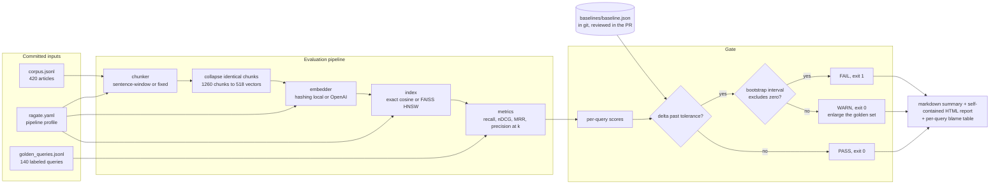

# rag-regression-gate

**A CI gate that blocks a pull request when RAG retrieval quality drops on a labeled golden set, using a tolerance plus a paired bootstrap so that noise on a small golden set does not cry wolf.**

[](https://github.com/USERNAME/rag-regression-gate/actions/workflows/ci.yml)
[](#tests-and-coverage)
[](#tests-and-coverage)
[](#the-three-outcomes-on-real-runs)
[](LICENSE)

## What this solves

- **A chunker or embedding change silently breaks retrieval, and nothing fails.** This gate scores a labeled golden set on every pull request and exits non-zero on a real drop: in the included demo it catches a fixed-size chunking change that costs 6.0 points of recall@5 and takes 13 of 140 questions from answered to unanswered.
- **Threshold-only gates fire on noise, so teams switch them off.** A drop must clear the agreed tolerance *and* a 95% paired bootstrap interval that excludes zero. The included borderline case (a 3.0 point drop, interval `[-0.0629, +0.0007]`) is reported as WARN with the instruction to enlarge the golden set, not as a failed build.
- **"Recall went down" is not actionable.** Every verdict ships a per-query blame table naming the documents that fell out of the top-k and the ones that took their place, so the fix starts where the loss happened.

## Executive summary

Retrieval pipelines fail quietly. A model swap, a chunk-size tweak, or a normalisation change moves which documents come back, and there is usually nothing in CI that notices, because the unit tests still pass and the service still returns 200. The failure surfaces later as users not finding answers. In this repository's own demo, one plausible refactor (sentence-window chunking to fixed 240-character slices) drops recall@5 from 0.864 to 0.804 and leaves 13 of 140 labeled questions with no correct document in the top 5. On a support search handling 5,000 queries a day, that ratio works out to roughly 460 searches a day that stop finding their answer; the 5,000 is an assumption, the 9.3% is measured.

`ragate` is a small command-line tool that turns retrieval quality into a build status. It evaluates a labeled golden set through a configurable pipeline (chunker, embedder, index), records per-query scores, and compares a candidate run against a baseline committed to git. Failing the build needs two independent conditions: the primary metric must fall further than the tolerance the team agreed on, and a paired bootstrap over per-query score differences must put the whole confidence interval below zero. When only the first holds, the gate says so and asks for more golden queries instead of blocking anyone. The pipeline stages are swappable behind narrow interfaces, so the same harness can measure a hosted embedding API, a fine-tuned local model, or an approximate index, and it ships as a composite GitHub Action.

On the committed 420-article corpus and 140-query golden set, the baseline pipeline scores recall@5 of 0.8636 against a theoretical ceiling of 0.9976, nDCG@5 of 0.8103, and a full gate run takes about 0.5 seconds, so it costs nothing to put on every pull request. The gate's three outcomes are all reproduced by a script in this repository (`tools/run_demo.sh`), and the screenshots below are that script's output, not mock-ups.

## The three outcomes on real runs

`tools/run_demo.sh` runs three candidate profiles against the committed baseline. Every number in these images was produced by that run.

**Regression caught, exit code 1.** A fixed-size chunking change: recall@5 0.8636 to 0.8039, 95% interval `[-0.1050, -0.0174]`.


**The same run as CI sees it**, structured JSON logs and the markdown summary that lands in the job summary:


**A drop the gate refuses to call a regression, exit code 0.** 3.0 points, interval `[-0.0629, +0.0007]`, verdict WARN with the reason stating that this golden set cannot separate it from run-to-run noise:


## Architecture



Failures are handled at three boundaries, each of which refuses rather than guesses: corpus loading rejects a golden label that points at a missing document, config loading rejects an unknown key or an impossible value, and the gate refuses to compare two reports whose corpus or `k` differ.

## Tech stack

| Technology | Role in this project | Why chosen here |
| --- | --- | --- |
| Python 3.10+ | The whole tool | The gate has to run as a step in someone else's CI with one `pip install`, which rules out a heavier runtime |
| numpy | Vector math, exact search, bootstrap resampling | 5,000 bootstrap resamples are one fancy-indexing operation on a 5,000 x 140 matrix; a Python loop would be seconds instead of milliseconds |
| Custom hashing embedder (blake2b) | Default embedding provider | Reproducible to the bit with no network and no model download, so a baseline recorded today is comparable tomorrow. Python's built-in `hash()` is salted per process and would break that |
| FAISS (HNSW, optional) | Second index backend | Lets the ANN penalty be measured deliberately (see ADR-001) instead of silently absorbed into the gate's noise floor |
| PyYAML | Config profiles | Candidate pipelines are committed as reviewable files, so a PR shows what changed about the pipeline, not just the code |
| pytest, pytest-cov | 92 tests, 93% line coverage | Metric implementations are asserted against hand computation, so a refactor cannot quietly redefine recall |
| ruff | Lint and import order | One tool, fast enough to run on every commit |
| Playwright + Chromium | Screenshot capture in `tools/capture_screenshots.py` | The README's images are rendered from the tool's real HTML output, so documentation cannot drift from behaviour |
| matplotlib | Benchmark charts | Charts are generated from `benchmark/results/*.json`, never hand-drawn |
| GitHub Actions (composite action) | Distribution | `action.yml` makes adoption five lines in another repository, which is the difference between a demo and a tool |

## Quickstart

Prerequisites: Python 3.10 or newer, `git`, and about 200 MB of disk for the optional FAISS extra.

```bash
git clone https://github.com/USERNAME/rag-regression-gate.git
cd rag-regression-gate
python -m venv .venv && source .venv/bin/activate    # Windows: .venv\Scripts\activate
pip install -e ".[dev,faiss]"

# 1. Confirm the committed corpus and golden set load, and score them
ragate eval -o reports/candidate.json

# 2. Compare against the committed baseline (exit code 0)
ragate gate

# 3. Reproduce the three demo verdicts, including the exit-1 regression
bash tools/run_demo.sh

# 4. Run the test suite with coverage
pytest --cov=ragate --cov-report=term -q

# 5. Regenerate the benchmarks and their charts (about 90 seconds)
python benchmark/bench_retrieval.py
python benchmark/bench_dedupe_effect.py
python benchmark/plot_results.py
```

Regenerating the corpus is optional and deterministic: `python data/generate_corpus.py --docs 420 --queries 140 --seed 20260812` reproduces the committed files byte for byte.

To use it on your own pipeline, point the profile at your data, record a baseline on a commit you trust, and commit it:

```bash
ragate -c my-profile.yaml baseline   # writes baselines/baseline.json
git add baselines/baseline.json && git commit -m "chore(baseline): record retrieval baseline"
```

In another repository, as a step:

```yaml
- uses: USERNAME/rag-regression-gate@main
  with:
    config: ragate.yaml
    baseline: baselines/baseline.json
    warn-only: "false"
```

## Performance under load

Method: `benchmark/bench_retrieval.py` times single-query searches, one query at a time rather than batched, because that is what a caller experiences and what the gate itself does. 140 golden queries x 3 passes per data point, k = 20 chunks retrieved, 512-dimension vectors, exact and HNSW backends over the same vectors. Hardware: 2 vCPU, 7 GB RAM container, Python 3.11.15. The corpus is padded with tenant-variant articles to reach each size; every quality number elsewhere in this README comes from the unpadded labeled corpus.


| corpus | documents | chunks | vectors indexed | exact p50 | exact p95 | exact p99 | HNSW p95 | HNSW score parity | index MB |
| --- | --- | --- | --- | --- | --- | --- | --- | --- | --- |
| 1x | 420 | 1260 | 518 | 0.081 ms | 0.152 ms | 0.204 ms | 0.120 ms | 1.00000 | 1.1 |
| 3x | 1260 | 4173 | 1601 | 0.121 ms | 0.201 ms | 0.273 ms | 0.147 ms | 0.99928 | 3.3 |
| 6x | 2520 | 8380 | 3167 | 0.204 ms | 0.287 ms | 0.334 ms | 0.236 ms | 0.99713 | 6.5 |
| 12x | 5040 | 17326 | 6364 | 0.435 ms | 0.569 ms | 0.748 ms | 0.231 ms | 0.99786 | 13.0 |
| 24x | 10080 | 34489 | 12673 | 1.110 ms | 1.390 ms | 4.434 ms | 0.335 ms | 0.99642 | 26.0 |

Where it degrades, honestly: exact search is O(n) per query and the table shows it, with p95 rising 9x between 518 and 12,673 vectors. The knee is at p99, not p50: at 24x the p99 of 4.43 ms is 4x the p50, because a 26 MB score matrix no longer fits comfortably in cache and the tail pays for memory traffic. HNSW is flat by comparison (0.12 ms to 0.34 ms across a 24x range) and gives up 0.4% of similarity mass at the largest size. For a golden set this is a non-issue, since a whole 140-query gate run costs about half a second; past roughly 10^6 vectors the gate should switch backends, and ADR-001 states the trigger.

"Score parity" is the honest way to measure an approximate index: the true cosine similarity of what HNSW returned, divided by the true cosine similarity of the exact top-k. Top-k set overlap alone punishes an index for swapping two documents of equal similarity, and it was the misleading measure that nearly produced a wrong conclusion in this repository (see the war story).

## Tests and coverage

92 tests, 93% line coverage, measured with `pytest --cov=ragate --cov-report=term`. The coverage floor is enforced in CI at 90% by parsing `coverage.xml`, so the badge cannot rot. The uncovered remainder is dominated by `embedders/openai_provider.py`, which cannot be exercised in an environment with no outbound network access; its error paths are tested, its request path is not, and nothing in this README claims otherwise.

## Architecture Decision Records

Full records in [`docs/adr/`](docs/adr/):

- [ADR-001: Exact search is the default index for evaluation, with HNSW available](docs/adr/ADR-001-exact-search-for-evaluation.md). The gate measures the pipeline, so the index must not contribute its own error.
- [ADR-002: The baseline is a JSON file in git, not a row in a tracking server](docs/adr/ADR-002-git-committed-baseline.md). The boring choice, taken against MLflow on purpose: a reference that changes without a commit produces builds that fail with no diff to point at.
- [ADR-003: A drop must clear both a tolerance and a paired bootstrap interval](docs/adr/ADR-003-paired-bootstrap-over-fixed-threshold.md). Why a paired bootstrap rather than a t-test, and why the gate is allowed to answer "I cannot tell".

## Intentionally out of scope

- **Generation quality.** This gate stops at retrieval: which documents come back, in what order. Answer faithfulness and groundedness need a different harness with a different labeling cost, and conflating the two produces a metric nobody can act on. Trigger to add it: once retrieval is fenced by this gate and regressions still reach users, the next measurement is generation.
- **Recording history and trends.** There is no dashboard of recall over time; `git log baselines/baseline.json` is the trend view. Trigger: more than one evaluation profile per repository, or a need to compare more than about 20 historical runs (ADR-002).
- **Reranker evaluation.** The pipeline is chunk, embed, search. A cross-encoder reranking stage is a natural fourth step and the `Embedder`/`VectorIndex` protocols leave room for it. Trigger: a reranker enters the production path, at which point the gate must measure the pipeline that actually serves traffic.
- **Parallel evaluation.** `evaluate.workers` exists in the config and is honoured as 1. Embedding 518 texts takes 300 ms, so concurrency would add complexity for no measurable win. Trigger: a golden-set run past 30 seconds, which for a hosted embedding API arrives at roughly 2,000 queries.

## Security and compliance

- **Secrets.** No credential is ever read from a config file. The only secret this tool can use is `OPENAI_API_KEY` from the environment, read once at provider construction. In CI it comes from an Actions secret; the production path is a cloud secret manager or Vault, injected as an environment variable at process start.
- **What is never logged.** Log records carry metric values, counts, timings, and identifiers. Query text and document text are never logged, because a golden set built from real user questions contains whatever users typed, which in a support corpus routinely includes names, account numbers, and internal hostnames. Query text appears only in the HTML and markdown reports, which are build artifacts under the same access control as the repository.
- **Least privilege in CI.** The workflow declares `permissions: contents: read`. The gate needs no write access to anything: it reads the repository, writes files into the workspace, and communicates its verdict through an exit code.
- **Supply chain.** Runtime dependencies are numpy and PyYAML. FAISS and the OpenAI SDK are optional extras, so a consumer that does not need them does not install them. Pinning is left to the consumer's lockfile rather than pinned here, which is the correct choice for a library-shaped tool and the wrong one for an application.
- **Data in the repository.** The committed corpus is synthetic, generated by `data/generate_corpus.py` from a seeded template grammar. No customer text, no scraped content, and no licence question.

## Failure modes

| Failure | Detection | Behaviour | Recovery |
| --- | --- | --- | --- |
| Baseline file missing (fresh repository, or someone deleted it) | `load_baseline` checks for the path before doing any work | Exit code 3 with a message naming the command that creates one | Run `ragate baseline` on a commit whose quality is trusted, and commit the file |
| Golden set changed, so the baseline is no longer comparable | Every report carries a fingerprint of corpus paths plus `k`; the gate compares fingerprints before comparing metrics | Exit code 3, refuses to produce a verdict, rather than reporting a fake regression | Re-record the baseline; the PR diff shows the new reference |
| A golden label points at a document that no longer exists | Query loading validates every label against the loaded corpus | Exit code 2 naming the query and the missing document ids | Fix the label or restore the document. Left as a warning it would depress recall permanently and silently |
| Embedding provider is down or rate-limiting | Provider adapter retries five times with exponential backoff starting at 0.5 s, logging each attempt | Raises `EmbedderError` after the last attempt, exit code 2, no verdict written | CI retries the job; a persistent outage is an infrastructure incident, and the gate correctly declines to guess a verdict |
| No `OPENAI_API_KEY` while the profile asks for the hosted provider | Checked at construction, before any work | Exit code 2 with the environment variable named and the local alternative suggested | Set the secret, or run with `RAGATE_EMBEDDER_PROVIDER=hashing` |
| Malformed corpus or golden-set line | JSONL reader reports the file and line number | Exit code 2 | Fix the named line; the parser never skips bad records, because a silently dropped query changes the metric |
| Corpus so large that the gate is slow | Stage timings are in every report and every log line | No automatic behaviour; the numbers make it visible | Switch to `index.backend=faiss` after measuring the parity cost (ADR-001) |
| Duplicate `doc_id` in the corpus | Rejected at load | Exit code 2 | Deduplicate the corpus. Two documents with one id would make the blame table ambiguous |
| Flaky verdicts across re-runs | Not possible by construction: the bootstrap seed is fixed and neither backend has an unseeded random component | Same inputs always produce the same verdict | If a verdict does change, the inputs changed, and the fingerprint plus per-query scores show where |

## Hardest problem solved

The approximate index looked fine, and then it looked broken, and both readings were wrong.

Having built the scaling benchmark, I compared HNSW against exact search by the obvious measure: how much of the top-k document set the two backends agree on. At the base corpus size agreement was 0.97, which is what the literature would predict. Padding the corpus to 3x dropped it to 0.57 and 12x to 0.54. Read at face value, that says HNSW is unusable at any real scale, which contradicts the entire industry, so the measurement was more likely wrong than the index.

My first hypothesis was ties. If many chunks score almost identically, set overlap punishes an index for returning an equally good document in a different order, so I checked the score spread across the top 20 and computed a tie-insensitive measure: the true cosine similarity of what HNSW returned, divided by the exact optimum. That refuted the hypothesis rather than confirming it. Parity was 0.82 with a worst case of 0.10, and the worst query's six HNSW results all shared an identical similarity of 0.1132 while exact search was returning 0.24. This was not a tie-ordering artifact; the search was genuinely landing somewhere bad. Second hypothesis: the metric. HNSW navigates by greedy descent over a proximity graph, which assumes a true metric, and I had built the index with `METRIC_INNER_PRODUCT`. That reasoning is correct and the fix is free, since for unit-length vectors ascending squared L2 is exactly descending cosine, so I made the change. Then I measured it in isolation, and it moved parity from 0.808 to 0.814, which is inside run-to-run variation. The comment in `indexes/faiss_index.py` says so, because a code comment claiming a win that the numbers do not support is worse than no comment.

The actual cause was visible only after counting: 2,422 of the 3,780 chunks in the padded index were byte-identical to another chunk. The corpus is templated, as real knowledge bases are, so whole passages repeat across articles, and my padding function made it worse by prefixing only the title, leaving every subsequent chunk identical across tenants. Duplicate points wreck an HNSW graph, because neighbour selection cannot build a useful neighbourhood out of vectors at zero distance from each other, and greedy search gets trapped among the copies. The fix was to stop indexing the same text more than once: group chunks by exact text, index each text once, and carry the list of documents that text belongs to, expanding hits back to documents at scoring time. On the labeled corpus that took the index from 1,260 vectors to 518 (58.9% fewer), cut a full evaluation from 707 ms to 343 ms, moved recall@5 from 0.8621 to 0.8636, and restored parity to 0.99999. At 12x it moved parity from 0.9096 to 0.99872.

Two things stayed in the repository as a result. The parity measure is now a first-class benchmark output, because it is what exposed the problem and set-overlap alone would have hidden it. And `benchmark/bench_dedupe_effect.py` regenerates the whole comparison on demand ([results](benchmark/results/dedupe_effect.md), [chart](docs/screenshots/dedupe_effect.png)), so the claim is reproducible rather than remembered. Fix commit: `fix(corpus): index identical chunk text once, mapped to all its documents`.


## Future work

- **A reranking stage behind the existing protocols**, evaluated the same way, so the gate measures the pipeline that actually serves traffic rather than its first two thirds.
- **Per-slice verdicts.** The golden set already tags each query with a scope (`platform` or `product`) and a task key. Reporting the metric per slice would catch a change that helps one query class while quietly breaking another, which an aggregate hides by design.
- **Golden-set health checks.** The gate can already say "this golden set cannot separate that drop from noise". The next step is to compute, from the current per-query variance, how many queries would be needed for the team's chosen tolerance to be detectable, and print that number.
- **Before real production use**: replace the synthetic corpus with a labeled sample of real traffic (a few hundred queries, labeled by the people who answer them), pin dependency versions in the consuming repository, and set the tolerance from two weeks of observed run-to-run variation rather than picking 2 points because it sounds reasonable.
- **First metric to watch after adoption**: the WARN rate. A gate that is mostly WARN is a gate whose golden set is too small to protect anything, and that is a measurable, fixable condition rather than an opinion.
